# Diagrama de Clases · Capas Data + Domain (detalle)

> Vista detallada de las capas de **persistencia** y **dominio**.
> Incluye entidades Room, DAOs, `AppDatabase`, patrón Repository (interfaces + implementaciones), enums de negocio y claves foráneas.

---

## Leyenda

| Capa | Color | Paquete |
|------|:-----:|---------|
| **Domain** | 🟦 Azul | `domain.model`, `domain.repository` |
| **Data** | 🟩 Verde | `data.entities`, `data.db`, `data.repository`, `data.SesionUsuario` |

**Notación de flechas**: `..|>` implementación · `-->` asociación · `..>` dependencia · `*--` composición · `"*" --> "1"` multiplicidad (FK).

---

## Diagrama

```mermaid
classDiagram
    direction LR

    %% ═══════════════════════════════════════════════════════════════
    %%  DOMAIN · ENUMS
    %% ═══════════════════════════════════════════════════════════════
    namespace domain_model {
        class NivelVecino {
            <<enumeration>>
            NOVATO
            ACTIVO
            VETERANO
            REFERENTE
        }
        class CategoriaServicio {
            <<enumeration>>
            HOGAR
            TECNOLOGIA
            EDUCACION
            COMPANIA
            RECADOS
            OTROS
        }
        class EstadoServicio {
            <<enumeration>>
            ACTIVO
            RESERVADO
            COMPLETADO
            CADUCADO
        }
        class EstadoTransaccion {
            <<enumeration>>
            PENDIENTE
            ACEPTADA
            COMPLETADA
            CANCELADA
        }
        class Barrio {
            <<enumeration>>
            +String displayName
        }
    }

    %% ═══════════════════════════════════════════════════════════════
    %%  DOMAIN · REPOSITORY INTERFACES
    %% ═══════════════════════════════════════════════════════════════
    namespace domain_repository {
        class UsuarioRepository {
            <<interface>>
            +insert(usuario) Long
            +update(usuario)
            +getById(id) Flow~Usuario~
            +getAll() Flow~List~
            +getByIdOnce(id) Usuario
            +updateSaldo(id, saldo)
            +buscarPorNombre(nombre) Usuario
        }
        class ServicioRepository {
            <<interface>>
            +insert(servicio) Long
            +update(servicio)
            +delete(servicio)
            +getById(id) Flow~Servicio~
            +getActivos() Flow~List~
            +getByUsuario(id) Flow~List~
            +getByCategoria(cat) Flow~List~
            +cambiarEstado(id, estado)
        }
        class TransaccionRepository {
            <<interface>>
            +insert(transaccion) Long
            +update(transaccion)
            +getByUsuario(id) Flow~List~
            +getByServicioYEstado(sid, estado) Transaccion
            +getByIdOnce(id) Transaccion
            +getConteoNotificaciones(id) Flow~Int~
        }
        class ValoracionRepository {
            <<interface>>
            +insert(valoracion) Long
            +getByValorado(id) Flow~List~
            +getByTransaccion(tid) Valoracion
            +getByTransaccionYValorador(tid, vid) Valoracion
        }
    }

    %% ═══════════════════════════════════════════════════════════════
    %%  DATA · ENTIDADES ROOM
    %% ═══════════════════════════════════════════════════════════════
    namespace data_entities {
        class Usuario {
            +Int idUsuario
            +String nombre
            +Barrio barrio
            +String avatarPath
            +Double saldoHoras
            +Int intercambiosTotal
            +NivelVecino nivel
            +Long fechaRegistro
            +calcularNivel() NivelVecino
        }
        class Servicio {
            +Int idServicio
            +Int idUsuarioFk
            +String titulo
            +String descripcion
            +CategoriaServicio categoria
            +String pictogramaId
            +Double costeHoras
            +EstadoServicio estado
            +Long fechaPublicacion
            +Long fechaCaducidad
            +estaActivo() Boolean
            +estaVencido() Boolean
            +estaCompletado() Boolean
        }
        class Transaccion {
            +Int idTransaccion
            +Int idCompradorFk
            +Int idVendedorFk
            +Int idServicioFk
            +Double horasTransferidas
            +EstadoTransaccion estado
            +Long timestamp
            +estaCompletada() Boolean
        }
        class Valoracion {
            +Int idValoracion
            +Int idTransaccionFk
            +Int idValoradorFk
            +Int idValoradoFk
            +String pictogramasJson
            +String comentario
            +Long timestamp
            +getPictogramasList() List
        }
    }

    %% ═══════════════════════════════════════════════════════════════
    %%  DATA · ROOM DAOs + DATABASE
    %% ═══════════════════════════════════════════════════════════════
    namespace data_db {
        class AppDatabase {
            <<abstract>>
            +usuarioDao() UsuarioDao
            +servicioDao() ServicioDao
            +transaccionDao() TransaccionDao
            +valoracionDao() ValoracionDao
            +getInstance(context)$ AppDatabase
        }
        class Converters {
            +fromBarrio(v) String
            +toBarrio(s) Barrio
            +fromNivelVecino(v) String
            +toNivelVecino(s) NivelVecino
            +fromCategoriaServicio(v) String
            +toCategoriaServicio(s) CategoriaServicio
            +fromEstadoServicio(v) String
            +toEstadoServicio(s) EstadoServicio
            +fromEstadoTransaccion(v) String
            +toEstadoTransaccion(s) EstadoTransaccion
        }
        class SeedDatabaseCallback {
            +onCreate(db)
        }
        class UsuarioDao {
            <<interface>>
            +insert(usuario) Long
            +update(usuario)
            +getById(id) Flow
            +getAll() Flow
            +getByIdOnce(id) Usuario
            +updateSaldo(id, saldo)
            +buscarPorNombre(nombre) Usuario
        }
        class ServicioDao {
            <<interface>>
            +insert(servicio) Long
            +update(servicio)
            +delete(servicio)
            +getById(id) Flow
            +getActivos() Flow
            +getByUsuario(uid) Flow
            +getByCategoria(cat) Flow
            +cambiarEstado(id, estado)
        }
        class TransaccionDao {
            <<interface>>
            +insert(t) Long
            +update(t)
            +getByUsuario(uid) Flow
            +getByServicio(sid) Transaccion
            +getByServicioYEstado(sid, e) Transaccion
            +getByIdOnce(id) Transaccion
            +getConteoNotificaciones(uid) Flow
        }
        class ValoracionDao {
            <<interface>>
            +insert(v) Long
            +getByValorado(uid) Flow
            +getByTransaccion(tid) Valoracion
            +getByTransaccionYValorador(tid, vid) Valoracion
        }
    }

    %% ═══════════════════════════════════════════════════════════════
    %%  DATA · REPOSITORY IMPLS + SESIÓN
    %% ═══════════════════════════════════════════════════════════════
    namespace data_repository {
        class UsuarioRepositoryImpl {
            -UsuarioDao usuarioDao
        }
        class ServicioRepositoryImpl {
            -ServicioDao servicioDao
        }
        class TransaccionRepositoryImpl {
            -TransaccionDao transaccionDao
        }
        class ValoracionRepositoryImpl {
            -ValoracionDao valoracionDao
        }
    }

    namespace data {
        class SesionUsuario {
            -SharedPreferences prefs
            +guardarUsuarioId(id)
            +obtenerUsuarioId() Int
            +haySesion() Boolean
            +cerrarSesion()
            +SIN_SESION$ Int
        }
    }

    %% ═══════════════════════════════════════════════════════════════
    %%  RELACIONES · ENTIDADES ↔ ENUMS
    %% ═══════════════════════════════════════════════════════════════
    Usuario --> Barrio : barrio
    Usuario --> NivelVecino : nivel
    Servicio --> CategoriaServicio : categoria
    Servicio --> EstadoServicio : estado
    Transaccion --> EstadoTransaccion : estado

    %% ═══════════════════════════════════════════════════════════════
    %%  RELACIONES · FOREIGN KEYS (ON DELETE CASCADE)
    %% ═══════════════════════════════════════════════════════════════
    Servicio "*" --> "1" Usuario : FK idUsuarioFk
    Transaccion "*" --> "1" Usuario : FK comprador
    Transaccion "*" --> "1" Usuario : FK vendedor
    Transaccion "*" --> "1" Servicio : FK idServicioFk
    Valoracion "*" --> "1" Transaccion : FK idTransaccionFk
    Valoracion "*" --> "1" Usuario : FK valorador
    Valoracion "*" --> "1" Usuario : FK valorado

    %% ═══════════════════════════════════════════════════════════════
    %%  RELACIONES · ROOM (DAOs, Converters, Seed)
    %% ═══════════════════════════════════════════════════════════════
    AppDatabase *-- UsuarioDao
    AppDatabase *-- ServicioDao
    AppDatabase *-- TransaccionDao
    AppDatabase *-- ValoracionDao
    AppDatabase ..> Converters : TypeConverters
    AppDatabase ..> SeedDatabaseCallback : callback

    UsuarioDao ..> Usuario
    ServicioDao ..> Servicio
    TransaccionDao ..> Transaccion
    ValoracionDao ..> Valoracion

    Converters ..> Barrio
    Converters ..> NivelVecino
    Converters ..> CategoriaServicio
    Converters ..> EstadoServicio
    Converters ..> EstadoTransaccion

    %% ═══════════════════════════════════════════════════════════════
    %%  RELACIONES · PATRÓN REPOSITORY
    %% ═══════════════════════════════════════════════════════════════
    UsuarioRepositoryImpl ..|> UsuarioRepository
    ServicioRepositoryImpl ..|> ServicioRepository
    TransaccionRepositoryImpl ..|> TransaccionRepository
    ValoracionRepositoryImpl ..|> ValoracionRepository

    UsuarioRepositoryImpl --> UsuarioDao
    ServicioRepositoryImpl --> ServicioDao
    TransaccionRepositoryImpl --> TransaccionDao
    ValoracionRepositoryImpl --> ValoracionDao

    %% ═══════════════════════════════════════════════════════════════
    %%  ESTILOS POR CAPA
    %% ═══════════════════════════════════════════════════════════════
    classDef capaDomain fill:#E3F2FD,stroke:#1565C0,stroke-width:1.5px,color:#0D47A1
    classDef capaData fill:#E8F5E9,stroke:#2E7D32,stroke-width:1.5px,color:#1B5E20

    class NivelVecino capaDomain
    class CategoriaServicio capaDomain
    class EstadoServicio capaDomain
    class EstadoTransaccion capaDomain
    class Barrio capaDomain
    class UsuarioRepository capaDomain
    class ServicioRepository capaDomain
    class TransaccionRepository capaDomain
    class ValoracionRepository capaDomain

    class Usuario capaData
    class Servicio capaData
    class Transaccion capaData
    class Valoracion capaData
    class AppDatabase capaData
    class Converters capaData
    class SeedDatabaseCallback capaData
    class UsuarioDao capaData
    class ServicioDao capaData
    class TransaccionDao capaData
    class ValoracionDao capaData
    class UsuarioRepositoryImpl capaData
    class ServicioRepositoryImpl capaData
    class TransaccionRepositoryImpl capaData
    class ValoracionRepositoryImpl capaData
    class SesionUsuario capaData
```

---

## Notas de diseño

### Inversión de dependencias
Las interfaces `domain.repository.*` no conocen Room ni SQLite. Las implementaciones concretas en `data.repository.*` cumplen esos contratos (`..|>`) y encapsulan los DAOs. Esto permitiría sustituir la fuente de datos (p. ej. añadir un cliente HTTP para una API remota) sin modificar los ViewModels ni ningún componente superior.

### Foreign Keys con CASCADE
Todas las claves foráneas se declaran con política `ON DELETE CASCADE`. Si se elimina un `Usuario`, se eliminan automáticamente sus servicios publicados, sus transacciones (tanto como comprador como vendedor) y sus valoraciones emitidas y recibidas.

### Multiplicidad de roles
Las flechas `Transaccion "*" --> "1" Usuario` aparecen duplicadas (una para `comprador`, otra para `vendedor`). Se trata de la misma tabla `usuario` referenciada con dos roles distintos. Lo mismo ocurre con `Valoracion` (roles `valorador` y `valorado`).

### Desnormalización deliberada
`Valoracion` almacena los tags de pictogramas ARASAAC en un único campo `pictogramasJson` serializado como JSON (String). No existe una tabla intermedia `valoracion_pictograma` porque los pictogramas siempre se consultan en bloque junto con la valoración y nunca se buscan por separado. El método `getPictogramasList()` parsea el JSON a una lista cuando se consume desde la UI.

### Patrón Singleton en AppDatabase
`AppDatabase.getInstance(context)` utiliza `@Volatile` + `synchronized` para garantizar una única instancia en toda la aplicación. Durante el desarrollo se usa `fallbackToDestructiveMigration`; en producción habría que definir migraciones manuales.

### Sesión local
`SesionUsuario` es un helper que envuelve `SharedPreferences` para persistir el `id` del usuario con sesión activa entre ejecuciones de la app. Centraliza las constantes y operaciones de sesión, desacoplando al resto del código del mecanismo concreto de almacenamiento.
