# Diagrama de Clases · Vista General

> Diagrama de alto nivel para visualizar la arquitectura **MVVM + Clean Architecture** de VecindApp.
> Muestra las clases e interfaces relevantes sin cuerpo; los detalles completos (atributos y métodos) se presentan en los dos diagramas siguientes del anexo.

---

## Leyenda

| Capa | Color | Contenido |
|------|:-----:|-----------|
| **Presentation** | 🟪 Morado | `MainActivity`, `MainViewModel`, Fragments, ViewModels. |
| **Application** | 🟨 Ámbar | `VecindAppApplication` (contenedor DI singleton). |
| **Domain** | 🟦 Azul | Interfaces de repositorio (contratos de acceso a datos). |
| **Data** | 🟩 Verde | Entidades Room, DAOs, implementaciones de repositorio, `AppDatabase`. |

**Genéricos `<T>`**: las cuatro interfaces de repositorio (`UsuarioRepository`, `ServicioRepository`, `TransaccionRepository`, `ValoracionRepository`), sus cuatro implementaciones `*Impl` y los cuatro DAOs comparten estructura, por lo que se representan con un genérico `XxxRepository<T>` / `XxxRepositoryImpl<T>` / `XxxDao<T>`. La multiplicidad real `"1" *-- "4"` se mantiene.

---

## Diagrama

```mermaid
classDiagram
    direction TB

    %% ═══ APPLICATION ═══
    class VecindAppApplication
    class MainActivity
    class MainViewModel

    %% ═══ UI · FRAGMENTS ═══
    namespace fragments {
        class LoginFragment
        class RegistroFragment
        class EscaparateFragment
        class CrearServicioFragment
        class DetalleServicioFragment
        class TransaccionFragment
        class PerfilFragment
        class HistorialFragment
        class ValoracionBottomSheetFragment
    }

    %% ═══ UI · VIEWMODELS ═══
    namespace viewmodels {
        class LoginViewModel
        class RegistroViewModel
        class EscaparateViewModel
        class CrearServicioViewModel
        class DetalleServicioViewModel
        class TransaccionViewModel
        class PerfilViewModel
        class HistorialViewModel
        class ValoracionViewModel
    }

    %% ═══ DOMAIN ═══
    namespace domain_repository {
        class XxxRepository~T~ {
            <<interface>>
        }
    }

    %% ═══ DATA ═══
    namespace data_repository {
        class XxxRepositoryImpl~T~
    }

    namespace data_db {
        class AppDatabase {
            <<abstract>>
        }
        class XxxDao~T~ {
            <<interface>>
        }
    }

    namespace data_entities {
        class Usuario
        class Servicio
        class Transaccion
        class Valoracion
    }

    %% ═══ RELACIONES · MVVM ═══
    LoginFragment --> LoginViewModel
    RegistroFragment --> RegistroViewModel
    EscaparateFragment --> EscaparateViewModel
    CrearServicioFragment --> CrearServicioViewModel
    DetalleServicioFragment --> DetalleServicioViewModel
    TransaccionFragment --> TransaccionViewModel
    PerfilFragment --> PerfilViewModel
    HistorialFragment --> HistorialViewModel
    ValoracionBottomSheetFragment --> ValoracionViewModel

    %% ═══ RELACIONES · CLEAN ARCH ═══
    MainActivity --> MainViewModel
    MainViewModel --> XxxRepository
    LoginViewModel --> XxxRepository
    RegistroViewModel --> XxxRepository
    EscaparateViewModel --> XxxRepository
    CrearServicioViewModel --> XxxRepository
    DetalleServicioViewModel --> XxxRepository
    TransaccionViewModel --> XxxRepository
    PerfilViewModel --> XxxRepository
    HistorialViewModel --> XxxRepository
    ValoracionViewModel --> XxxRepository

    XxxRepositoryImpl ..|> XxxRepository
    XxxRepositoryImpl --> XxxDao
    AppDatabase "1" *-- "4" XxxDao
    XxxDao ..> Usuario
    XxxDao ..> Servicio
    XxxDao ..> Transaccion
    XxxDao ..> Valoracion

    %% ═══ RELACIONES · CONTENEDOR DI ═══
    VecindAppApplication *-- AppDatabase
    VecindAppApplication "1" *-- "4" XxxRepositoryImpl

    %% ═══ ESTILOS POR CAPA ═══
    classDef capaDomain fill:#E3F2FD,stroke:#1565C0,stroke-width:1.5px,color:#0D47A1
    classDef capaData fill:#E8F5E9,stroke:#2E7D32,stroke-width:1.5px,color:#1B5E20
    classDef capaApp fill:#FFF8E1,stroke:#EF6C00,stroke-width:1.5px,color:#E65100
    classDef capaUI fill:#F3E5F5,stroke:#6A1B9A,stroke-width:1.5px,color:#4A148C

    class XxxRepository capaDomain

    class Usuario capaData
    class Servicio capaData
    class Transaccion capaData
    class Valoracion capaData
    class AppDatabase capaData
    class XxxDao capaData
    class XxxRepositoryImpl capaData

    class VecindAppApplication capaApp
    class MainActivity capaApp
    class MainViewModel capaApp

    class LoginFragment capaUI
    class RegistroFragment capaUI
    class EscaparateFragment capaUI
    class CrearServicioFragment capaUI
    class DetalleServicioFragment capaUI
    class TransaccionFragment capaUI
    class PerfilFragment capaUI
    class HistorialFragment capaUI
    class ValoracionBottomSheetFragment capaUI

    class LoginViewModel capaUI
    class RegistroViewModel capaUI
    class EscaparateViewModel capaUI
    class CrearServicioViewModel capaUI
    class DetalleServicioViewModel capaUI
    class TransaccionViewModel capaUI
    class PerfilViewModel capaUI
    class HistorialViewModel capaUI
    class ValoracionViewModel capaUI
```

---

## Lectura del diagrama

- **Flujo MVVM**: cada `Fragment` (Vista) observa estado reactivo (`StateFlow`) de su `ViewModel` correspondiente mediante `by viewModels { XxxViewModel.Factory(...) }`.
- **Inversión de dependencias (Clean Architecture)**: los `ViewModel` no conocen Room; dependen exclusivamente de las interfaces definidas en `domain.repository`. Las implementaciones concretas viven en `data.repository` y encapsulan los DAOs de Room.
- **Contenedor de dependencias manual**: `VecindAppApplication` instancia de forma perezosa (`by lazy`) la `AppDatabase` y los cuatro repositorios. Cualquier Fragment accede a ellos mediante `application as VecindAppApplication`, evitando introducir Hilt o Dagger.

Los detalles de atributos, métodos, relaciones Foreign Key, enums de dominio, modelos de presentación y utilidades transversales se amplían en los diagramas **Data + Domain** y **Presentation** del anexo.
