# Diagrama de Clases · Capa Presentation (detalle)

> Vista detallada de la capa de **presentación** organizada por feature.
> Incluye `MainActivity`, `MainViewModel`, `VecindAppApplication`, todos los Fragments, ViewModels, Adapters, modelos de presentación y utilidades transversales.

---

## Leyenda

| Capa | Color | Paquete |
|------|:-----:|---------|
| **Application** | 🟨 Ámbar | `VecindAppApplication` |
| **Presentation** | 🟪 Morado | `ui.*`, `MainActivity`, `MainViewModel` |
| **Utilidades** | ⬜ Gris | `ui.common` |

**Dependencias a Data/Domain**: los ViewModels apuntan a las interfaces `XxxRepository<T>` que se detallan en el diagrama **Data + Domain**. Los modelos de presentación (`TransaccionUI`, `HistorialItem`) envuelven entidades Room que también se documentan allí.

---

## Diagrama

```mermaid
classDiagram
    direction LR

    %% ═══════════════════════════════════════════════════════════════
    %%  RAÍZ · APPLICATION + MAIN
    %% ═══════════════════════════════════════════════════════════════
    namespace root {
        class VecindAppApplication {
            +AppDatabase database
            +UsuarioRepository usuarioRepository
            +ServicioRepository servicioRepository
            +TransaccionRepository transaccionRepository
            +ValoracionRepository valoracionRepository
        }
        class MainActivity {
            -MainViewModel mainViewModel
            -Boolean badgeIniciado
            -configurarNavegacion()
            -iniciarBadge(nav)
        }
        class MainViewModel {
            -TransaccionRepository transaccionRepository
            +StateFlow notificaciones
            +setUsuarioId(id)
        }
    }

    %% ═══════════════════════════════════════════════════════════════
    %%  UI · AUTH
    %% ═══════════════════════════════════════════════════════════════
    namespace ui_auth {
        class LoginFragment {
            -LoginViewModel viewModel
            -TtsHelper ttsHelper
        }
        class LoginViewModel {
            -UsuarioDao usuarioDao
            +StateFlow usuarioEncontrado
            +StateFlow error
            +iniciarSesion(nombre)
            +limpiarError()
        }
        class RegistroFragment {
            -RegistroViewModel viewModel
        }
        class RegistroViewModel {
            -UsuarioRepository usuarioRepository
            +StateFlow registrado
            +StateFlow error
            +registrar(nombre, barrio)
            +limpiarError()
        }
    }

    %% ═══════════════════════════════════════════════════════════════
    %%  UI · ESCAPARATE
    %% ═══════════════════════════════════════════════════════════════
    namespace ui_escaparate {
        class EscaparateFragment {
            -EscaparateViewModel viewModel
            -ServicioAdapter adapter
        }
        class EscaparateViewModel {
            -ServicioRepository servicioRepository
            +StateFlow servicios
            +StateFlow filtroActivo
            +filtrarPorCategoria(cat)
            +quitarFiltro()
        }
        class ServicioAdapter {
            +Lambda onServicioClick
            +Lambda onServicioLongClick
            -ServicioViewHolder
            -ServicioDiffCallback
        }
    }

    %% ═══════════════════════════════════════════════════════════════
    %%  UI · SERVICIO
    %% ═══════════════════════════════════════════════════════════════
    namespace ui_servicio {
        class CrearServicioFragment {
            -CrearServicioViewModel viewModel
        }
        class CrearServicioViewModel {
            -ServicioRepository servicioRepository
            +StateFlow guardado
            +StateFlow error
            +guardarServicio(titulo, desc, cat, coste, uid)
        }
        class DetalleServicioFragment {
            -DetalleServicioViewModel viewModel
        }
        class DetalleServicioViewModel {
            -ServicioRepository servicioRepository
            -TransaccionRepository transaccionRepository
            -UsuarioRepository usuarioRepository
            -ValoracionRepository valoracionRepository
            +StateFlow servicio
            +StateFlow valoracion
            +StateFlow eliminado
            +StateFlow solicitado
            +cargarServicio(id)
            +solicitarServicio(cid)
            +cancelarSolicitud()
            +eliminarServicio()
            +actualizarServicio(...)
        }
    }

    %% ═══════════════════════════════════════════════════════════════
    %%  UI · TRANSACCION
    %% ═══════════════════════════════════════════════════════════════
    namespace ui_transaccion {
        class TransaccionFragment {
            -TransaccionViewModel viewModel
            -TransaccionAdapter adapter
        }
        class TransaccionViewModel {
            -TransaccionRepository transaccionRepository
            -ServicioRepository servicioRepository
            -UsuarioRepository usuarioRepository
            -ValoracionRepository valoracionRepository
            -Int usuarioActualId
            +StateFlow transacciones
            +StateFlow mensaje
            +aceptarTransaccion(item)
            +completarTransaccion(item)
            +cancelarTransaccion(item)
        }
        class TransaccionAdapter {
            +Lambda onAceptar
            +Lambda onCompletar
            +Lambda onCancelar
            +Lambda onValorar
            +Lambda onItemClick
        }
        class TransaccionUI {
            +Transaccion transaccion
            +String tituloServicio
            +String rol
            +Boolean puedeAceptar
            +Boolean puedeCompletar
            +Boolean puedeCancelar
            +Boolean puedeValorar
        }
    }

    %% ═══════════════════════════════════════════════════════════════
    %%  UI · PERFIL
    %% ═══════════════════════════════════════════════════════════════
    namespace ui_perfil {
        class PerfilFragment {
            -PerfilViewModel viewModel
            -ServicioAdapter adapter
        }
        class PerfilViewModel {
            -UsuarioRepository usuarioRepository
            -ServicioRepository servicioRepository
            -Int usuarioActualId
            +StateFlow usuario
            +StateFlow misServicios
        }
    }

    %% ═══════════════════════════════════════════════════════════════
    %%  UI · HISTORIAL
    %% ═══════════════════════════════════════════════════════════════
    namespace ui_historial {
        class HistorialFragment {
            -HistorialViewModel viewModel
            -HistorialAdapter adapter
            -BarChart grafico
        }
        class HistorialViewModel {
            -TransaccionRepository transaccionRepository
            -ServicioRepository servicioRepository
            -ValoracionRepository valoracionRepository
            -Int usuarioActualId
            +StateFlow completadas
            +StateFlow canceladas
            +StateFlow datosGrafico
            +obtenerValoracion(tid) Valoracion
        }
        class HistorialAdapter {
            -Int usuarioActualId
            +Lambda onItemClick
        }
        class HistorialItem {
            +Transaccion transaccion
            +String tituloServicio
            +Boolean esVendedor
        }
        class DatoMensual {
            +String mes
            +Double ganadas
            +Double gastadas
        }
    }

    %% ═══════════════════════════════════════════════════════════════
    %%  UI · VALORACION
    %% ═══════════════════════════════════════════════════════════════
    namespace ui_valoracion {
        class ValoracionBottomSheetFragment {
            -ValoracionViewModel viewModel
        }
        class DetalleValoracionBottomSheet
        class ValoracionViewModel {
            -ValoracionRepository valoracionRepository
            +StateFlow guardada
            +StateFlow error
            +guardarValoracion(tid, vid, vado, pictos, com)
        }
        class PictogramaMapper {
            <<object>>
            +obtenerDescripcion(ctx, tag) String
            +obtenerDrawable(tag) Int
        }
    }

    %% ═══════════════════════════════════════════════════════════════
    %%  UI · COMMON (utilidades transversales)
    %% ═══════════════════════════════════════════════════════════════
    namespace ui_common {
        class TtsHelper {
            -TextToSpeech tts
            -String pendingText
            -Boolean isReady
            +speak(text)
            +stop()
            +formatearCosteHumano(coste)$ String
            +formatearCosteConUnidad(coste)$ String
        }
        class CategoriaMapper {
            <<object>>
            +obtenerDrawable(categoria) Int
        }
        class SnackbarUtils {
            <<ext>>
            +Fragment mostrarSnackbar(msg)
        }
    }

    %% ═══════════════════════════════════════════════════════════════
    %%  RELACIONES · MAIN
    %% ═══════════════════════════════════════════════════════════════
    MainActivity --> MainViewModel

    %% ═══════════════════════════════════════════════════════════════
    %%  RELACIONES · FRAGMENT → VIEWMODEL / ADAPTER / HELPER
    %% ═══════════════════════════════════════════════════════════════
    LoginFragment --> LoginViewModel
    LoginFragment --> TtsHelper
    RegistroFragment --> RegistroViewModel
    EscaparateFragment --> EscaparateViewModel
    EscaparateFragment --> ServicioAdapter
    CrearServicioFragment --> CrearServicioViewModel
    DetalleServicioFragment --> DetalleServicioViewModel
    TransaccionFragment --> TransaccionViewModel
    TransaccionFragment --> TransaccionAdapter
    PerfilFragment --> PerfilViewModel
    PerfilFragment --> ServicioAdapter
    HistorialFragment --> HistorialViewModel
    HistorialFragment --> HistorialAdapter
    ValoracionBottomSheetFragment --> ValoracionViewModel

    %% ═══════════════════════════════════════════════════════════════
    %%  RELACIONES · ADAPTERS Y MODELOS DE PRESENTACIÓN
    %% ═══════════════════════════════════════════════════════════════
    ServicioAdapter ..> CategoriaMapper
    ServicioAdapter ..> TtsHelper
    TransaccionAdapter ..> TransaccionUI
    TransaccionAdapter ..> TtsHelper
    HistorialAdapter ..> HistorialItem
    HistorialAdapter ..> TtsHelper

    TransaccionViewModel ..> TransaccionUI
    HistorialViewModel ..> HistorialItem
    HistorialViewModel ..> DatoMensual

    ValoracionBottomSheetFragment ..> PictogramaMapper
    DetalleValoracionBottomSheet ..> PictogramaMapper

    %% ═══════════════════════════════════════════════════════════════
    %%  ESTILOS POR CAPA
    %% ═══════════════════════════════════════════════════════════════
    classDef capaApp fill:#FFF8E1,stroke:#EF6C00,stroke-width:1.5px,color:#E65100
    classDef capaUI fill:#F3E5F5,stroke:#6A1B9A,stroke-width:1.5px,color:#4A148C
    classDef capaCommon fill:#ECEFF1,stroke:#455A64,stroke-width:1.5px,color:#263238

    class VecindAppApplication capaApp
    class MainActivity capaApp
    class MainViewModel capaApp

    class LoginFragment capaUI
    class LoginViewModel capaUI
    class RegistroFragment capaUI
    class RegistroViewModel capaUI
    class EscaparateFragment capaUI
    class EscaparateViewModel capaUI
    class ServicioAdapter capaUI
    class CrearServicioFragment capaUI
    class CrearServicioViewModel capaUI
    class DetalleServicioFragment capaUI
    class DetalleServicioViewModel capaUI
    class TransaccionFragment capaUI
    class TransaccionViewModel capaUI
    class TransaccionAdapter capaUI
    class TransaccionUI capaUI
    class PerfilFragment capaUI
    class PerfilViewModel capaUI
    class HistorialFragment capaUI
    class HistorialViewModel capaUI
    class HistorialAdapter capaUI
    class HistorialItem capaUI
    class DatoMensual capaUI
    class ValoracionBottomSheetFragment capaUI
    class DetalleValoracionBottomSheet capaUI
    class ValoracionViewModel capaUI
    class PictogramaMapper capaUI

    class TtsHelper capaCommon
    class CategoriaMapper capaCommon
    class SnackbarUtils capaCommon
```

---

## Notas de diseño

### Single Activity + Navigation Component
Toda la aplicación se apoya en una única `MainActivity` que aloja un `NavHostFragment`. Los Fragments se intercambian dentro de ese contenedor según el grafo `nav_graph.xml`. La `BottomNavigationView` se conecta al `NavController` para cambiar de pestaña.

### Inyección manual de dependencias
Cada `ViewModel` expone una clase anidada `Factory : ViewModelProvider.Factory` (no mostrada en el diagrama para reducir ruido visual) que permite inyectar los repositorios por constructor. Los Fragment instancian su ViewModel mediante `by viewModels { XxxViewModel.Factory(repo) }`, obteniendo el repositorio desde `VecindAppApplication`.

### Reactividad con StateFlow
Todos los ViewModels exponen su estado como `StateFlow` observable. Los Fragments recogen los flujos con `repeatOnLifecycle(Lifecycle.State.STARTED)`, garantizando que la UI se actualice únicamente cuando el Fragment está visible y evitando memory leaks.

### Modelos de presentación
`TransaccionUI`, `HistorialItem` y `DatoMensual` son *data classes* que envuelven las entidades Room con datos adicionales derivados (título de servicio, rol del usuario, agregados mensuales, flags de acciones permitidas). Viven en la capa UI y evitan contaminar las entidades del dominio con lógica específica de presentación.

### Badge de notificaciones
`MainViewModel` expone un `StateFlow<Int>` con el conteo reactivo de notificaciones. Emplea `flatMapLatest` para resuscribirse al DAO cuando cambia el usuario activo, evitando *state bleed* entre sesiones. `MainActivity` observa este flujo y actualiza dinámicamente el badge de la pestaña de transacciones en la `BottomNavigationView`.

### Utilidades transversales
- `TtsHelper`: wrapper del motor Text-to-Speech de Android ligado al `Lifecycle` del Fragment. Expone además formateadores estáticos de horas (`0.5h` → "media hora").
- `CategoriaMapper` / `PictogramaMapper`: `object` singletons Kotlin que centralizan el mapeo de enums y tags ARASAAC a recursos drawable, evitando lógica condicional dispersa por los Adapters.
- `SnackbarUtils`: funciones de extensión sobre `Fragment` para mostrar Snackbars ancladas al `BottomNav`. Sustituye la API obsoleta de `Toast` aportando una UX visual consistente.

### Reutilización de Adapters
`ServicioAdapter` se reutiliza en `EscaparateFragment` (listado general de servicios activos) y en `PerfilFragment` (sub-sección "Mis servicios"), ya que ambas pantallas comparten la misma estructura visual de tarjeta.
