# Diagrama de Clases · VecindApp

> Generado a partir del código fuente en `app/src/main/java/com/example/vecindapp/`.
> Arquitectura: **MVVM + Clean Architecture** con inyección manual de dependencias.

---

## Visión general por capas

| Capa | Color | Paquetes | Responsabilidad |
|------|:-----:|----------|-----------------|
| **Presentation** | 🟪 Morado | `ui.*`, `MainActivity`, `MainViewModel` | Fragments, ViewModels, Adapters y modelos de presentación. |
| **Application** | 🟨 Ámbar | `VecindAppApplication` | Contenedor singleton de base de datos y repositorios. |
| **Domain** | 🟦 Azul | `domain.repository` | Contratos de repositorio (interfaces). |
| **Data** | 🟩 Verde | `data.entities`, `data.db`, `data.repository`, `data.SesionUsuario` | Entidades Room, DAOs, `AppDatabase`, implementaciones de repositorio y gestión de sesión. |

---

## Cómo leer el diagrama

**Notación de flechas (UML adaptada a Mermaid)**

| Símbolo | Significado |
|:-------:|-------------|
| `..|>` | Implementación de interfaz (`Impl` realiza el contrato). |
| `-->` | Asociación dirigida (el origen mantiene referencia al destino). |
| `..>` | Dependencia débil (el origen usa al destino pero no lo guarda). |
| `*--` | Composición (el contenedor posee el ciclo de vida del contenido). |
| `"*" --> "1"` | Multiplicidad (muchos → uno; se usa para representar FKs). |

**Estereotipos UML usados**

`<<interface>>` · `<<abstract>>`.

**Tipos genéricos fusionados `<T>`**

Los doce tipos que comparten forma (cuatro interfaces de repositorio, cuatro implementaciones y cuatro DAOs) se representan con un único genérico parametrizado por `T`:

| En el diagrama | En el código |
|----------------|--------------|
| `XxxRepository<T>` | `UsuarioRepository`, `ServicioRepository`, `TransaccionRepository`, `ValoracionRepository` |
| `XxxRepositoryImpl<T>` | `UsuarioRepositoryImpl`, `ServicioRepositoryImpl`, `TransaccionRepositoryImpl`, `ValoracionRepositoryImpl` |
| `XxxDao<T>` | `UsuarioDao`, `ServicioDao`, `TransaccionDao`, `ValoracionDao` |

---

## Elementos documentados fuera del diagrama

Para mejorar la legibilidad se han extraído del diagrama los elementos secundarios. Sus detalles completos se encuentran en el código fuente y en la documentación KDoc asociada.

### Enums de dominio (`domain.model`)

| Enum | Valores | Usado por |
|------|---------|-----------|
| `NivelVecino` | `NOVATO`, `ACTIVO`, `VETERANO`, `REFERENTE` | `Usuario.nivel` |
| `CategoriaServicio` | `HOGAR`, `TECNOLOGIA`, `EDUCACION`, `COMPANIA`, `RECADOS`, `OTROS` | `Servicio.categoria` |
| `EstadoServicio` | `ACTIVO`, `RESERVADO`, `COMPLETADO`, `CADUCADO` | `Servicio.estado` |
| `EstadoTransaccion` | `PENDIENTE`, `ACEPTADA`, `COMPLETADA`, `CANCELADA` | `Transaccion.estado` |
| `Barrio` | (enum con `displayName: String`; 15 barrios de Zaragoza) | `Usuario.barrio` |

### Utilidades transversales (`ui.common` y helpers)

| Clase | Tipo | Responsabilidad |
|-------|------|-----------------|
| `TtsHelper` | clase ligada a `Lifecycle` | Wrapper del motor Text-to-Speech + formateadores estáticos de horas. |
| `CategoriaMapper` | `<<object>>` singleton | Mapeo `CategoriaServicio` → recurso drawable. |
| `PictogramaMapper` | `<<object>>` singleton | Mapeo tag ARASAAC → descripción y drawable. |
| `SnackbarUtils` | funciones de extensión Kotlin sobre `Fragment` | Mostrar snackbars ancladas al `BottomNav`. |
| `Converters` | clase Room `@TypeConverters` | Conversión bidireccional de los 5 enums ↔ `String` para Room. |
| `SeedDatabaseCallback` | `RoomDatabase.Callback` | Precarga 2 usuarios y 1 servicio de prueba en la primera creación de la BBDD. |

Estas clases se consumen desde Adapters, Fragments y `AppDatabase` respectivamente, pero no aportan estructura al esqueleto arquitectónico y por eso se mantienen fuera del diagrama.

---

## Diagrama completo

```mermaid
classDiagram
    direction LR

    %% ═══════════════════════════════════════════════════════════════
    %%  PRESENTATION · RAÍZ
    %% ═══════════════════════════════════════════════════════════════
    namespace root {
        class VecindAppApplication
        class MainActivity
        class MainViewModel {
            +StateFlow notificaciones
            +setUsuarioId()
        }
    }

    %% ═══════════════════════════════════════════════════════════════
    %%  PRESENTATION · UI
    %% ═══════════════════════════════════════════════════════════════
    namespace ui_auth {
        class LoginFragment
        class LoginViewModel {
            +StateFlow usuarioEncontrado
            +StateFlow error
            +iniciarSesion()
            +limpiarError()
        }
        class RegistroFragment
        class RegistroViewModel {
            +StateFlow registrado
            +StateFlow error
            +registrar()
            +limpiarError()
        }
    }

    namespace ui_escaparate {
        class EscaparateFragment
        class EscaparateViewModel {
            +StateFlow servicios
            +StateFlow filtroActivo
            +filtrarPorCategoria()
            +quitarFiltro()
        }
        class ServicioAdapter {
            +Lambda onServicioClick
            +Lambda onServicioLongClick
        }
    }

    namespace ui_servicio {
        class CrearServicioFragment
        class CrearServicioViewModel {
            +StateFlow guardado
            +StateFlow error
            +guardarServicio()
        }
        class DetalleServicioFragment
        class DetalleServicioViewModel {
            +StateFlow servicio
            +StateFlow valoracion
            +StateFlow eliminado
            +StateFlow solicitado
            +cargarServicio()
            +solicitarServicio()
            +cancelarSolicitud()
            +eliminarServicio()
            +actualizarServicio()
        }
    }

    namespace ui_transaccion {
        class TransaccionFragment
        class TransaccionViewModel {
            +StateFlow transacciones
            +StateFlow mensaje
            +aceptarTransaccion()
            +completarTransaccion()
            +cancelarTransaccion()
        }
        class TransaccionAdapter {
            +Lambda onAceptar
            +Lambda onCompletar
            +Lambda onCancelar
            +Lambda onValorar
            +Lambda onItemClick
        }
        class TransaccionUI {
            +Transaccion transaccion
            +String tituloServicio
            +String rol
            +Boolean puedeAceptar
            +Boolean puedeCompletar
            +Boolean puedeCancelar
            +Boolean puedeValorar
        }
    }

    namespace ui_perfil {
        class PerfilFragment
        class PerfilViewModel {
            +StateFlow usuario
            +StateFlow misServicios
        }
    }

    namespace ui_historial {
        class HistorialFragment
        class HistorialViewModel {
            +StateFlow completadas
            +StateFlow canceladas
            +StateFlow datosGrafico
            +obtenerValoracion()
        }
        class HistorialAdapter {
            +Lambda onItemClick
        }
        class HistorialItem {
            +Transaccion transaccion
            +String tituloServicio
            +Boolean esVendedor
        }
        class DatoMensual {
            +String mes
            +Double ganadas
            +Double gastadas
        }
    }

    namespace ui_valoracion {
        class ValoracionBottomSheetFragment
        class DetalleValoracionBottomSheet
        class ValoracionViewModel {
            +StateFlow guardada
            +StateFlow error
            +guardarValoracion()
        }
    }

    %% ═══════════════════════════════════════════════════════════════
    %%  DOMAIN · INTERFAZ DE REPOSITORIO (genérica, fusiona 4)
    %% ═══════════════════════════════════════════════════════════════
    namespace domain_repository {
        class XxxRepository~T~ {
            <<interface>>
            +insert()
            +update()
            +delete()
            +getById()
            +getAll()
            +...específicos por entidad
        }
    }

    %% ═══════════════════════════════════════════════════════════════
    %%  DATA · IMPLEMENTACIÓN DE REPOSITORIO + SESIÓN
    %% ═══════════════════════════════════════════════════════════════
    namespace data_repository {
        class XxxRepositoryImpl~T~ {
            -XxxDao dao
        }
    }

    namespace data {
        class SesionUsuario {
            +guardarUsuarioId()
            +obtenerUsuarioId()
            +haySesion()
            +cerrarSesion()
            +SIN_SESION$
        }
    }

    %% ═══════════════════════════════════════════════════════════════
    %%  DATA · ROOM (AppDatabase + DAO genérico)
    %% ═══════════════════════════════════════════════════════════════
    namespace data_db {
        class AppDatabase {
            <<abstract>>
            +usuarioDao()
            +servicioDao()
            +transaccionDao()
            +valoracionDao()
            +getInstance()$
        }
        class XxxDao~T~ {
            <<interface>>
            +insert()
            +update()
            +delete()
            +getById()
            +getAll()
            +...específicos por entidad
        }
    }

    %% ═══════════════════════════════════════════════════════════════
    %%  DATA · ENTIDADES ROOM
    %% ═══════════════════════════════════════════════════════════════
    namespace data_entities {
        class Usuario {
            +Int idUsuario
            +String nombre
            +Barrio barrio
            +String avatarPath
            +Double saldoHoras
            +Int intercambiosTotal
            +NivelVecino nivel
            +Long fechaRegistro
            +calcularNivel()
        }
        class Servicio {
            +Int idServicio
            +Int idUsuarioFk
            +String titulo
            +String descripcion
            +CategoriaServicio categoria
            +Double costeHoras
            +EstadoServicio estado
            +Long fechaPublicacion
            +Long fechaCaducidad
            +estaActivo()
            +estaVencido()
            +estaCompletado()
        }
        class Transaccion {
            +Int idTransaccion
            +Int idCompradorFk
            +Int idVendedorFk
            +Int idServicioFk
            +Double horasTransferidas
            +EstadoTransaccion estado
            +Long timestamp
            +estaCompletada()
        }
        class Valoracion {
            +Int idValoracion
            +Int idTransaccionFk
            +Int idValoradorFk
            +Int idValoradoFk
            +String pictogramasJson
            +String comentario
            +Long timestamp
            +getPictogramasList()
        }
    }

    %% ═══════════════════════════════════════════════════════════════
    %%  RELACIONES · FOREIGN KEYS (multiplicidad *..1)
    %% ═══════════════════════════════════════════════════════════════
    Servicio "*" --> "1" Usuario : FK idUsuarioFk
    Transaccion "*" --> "1" Usuario : FK comprador
    Transaccion "*" --> "1" Usuario : FK vendedor
    Transaccion "*" --> "1" Servicio : FK idServicioFk
    Valoracion "*" --> "1" Transaccion : FK idTransaccionFk
    Valoracion "*" --> "1" Usuario : FK valorador
    Valoracion "*" --> "1" Usuario : FK valorado

    %% ═══════════════════════════════════════════════════════════════
    %%  RELACIONES · ROOM
    %% ═══════════════════════════════════════════════════════════════
    AppDatabase "1" *-- "4" XxxDao

    %% ═══════════════════════════════════════════════════════════════
    %%  RELACIONES · PATRÓN REPOSITORY
    %% ═══════════════════════════════════════════════════════════════
    XxxRepositoryImpl ..|> XxxRepository
    XxxRepositoryImpl --> XxxDao

    %% ═══════════════════════════════════════════════════════════════
    %%  RELACIONES · CONTENEDOR DE DEPENDENCIAS
    %% ═══════════════════════════════════════════════════════════════
    VecindAppApplication *-- AppDatabase
    VecindAppApplication "1" *-- "4" XxxRepositoryImpl

    %% ═══════════════════════════════════════════════════════════════
    %%  RELACIONES · MAIN
    %% ═══════════════════════════════════════════════════════════════
    MainActivity --> MainViewModel
    MainActivity --> SesionUsuario
    MainViewModel --> XxxRepository

    %% ═══════════════════════════════════════════════════════════════
    %%  RELACIONES · FRAGMENT → VIEWMODEL / ADAPTER
    %% ═══════════════════════════════════════════════════════════════
    LoginFragment --> LoginViewModel
    LoginFragment --> SesionUsuario
    RegistroFragment --> RegistroViewModel
    RegistroFragment --> SesionUsuario
    EscaparateFragment --> EscaparateViewModel
    EscaparateFragment --> ServicioAdapter
    CrearServicioFragment --> CrearServicioViewModel
    DetalleServicioFragment --> DetalleServicioViewModel
    TransaccionFragment --> TransaccionViewModel
    TransaccionFragment --> TransaccionAdapter
    PerfilFragment --> PerfilViewModel
    PerfilFragment --> ServicioAdapter
    HistorialFragment --> HistorialViewModel
    HistorialFragment --> HistorialAdapter
    ValoracionBottomSheetFragment --> ValoracionViewModel

    %% ═══════════════════════════════════════════════════════════════
    %%  RELACIONES · VIEWMODEL → REPOSITORY
    %% ═══════════════════════════════════════════════════════════════
    LoginViewModel --> XxxDao
    RegistroViewModel --> XxxRepository
    EscaparateViewModel --> XxxRepository
    CrearServicioViewModel --> XxxRepository
    DetalleServicioViewModel --> XxxRepository
    TransaccionViewModel --> XxxRepository
    PerfilViewModel --> XxxRepository
    HistorialViewModel --> XxxRepository
    ValoracionViewModel --> XxxRepository

    %% ═══════════════════════════════════════════════════════════════
    %%  RELACIONES · ADAPTERS Y MODELOS DE PRESENTACIÓN
    %% ═══════════════════════════════════════════════════════════════
    ServicioAdapter ..> Servicio
    TransaccionAdapter ..> TransaccionUI
    HistorialAdapter ..> HistorialItem

    TransaccionUI --> Transaccion
    HistorialItem --> Transaccion
    TransaccionViewModel ..> TransaccionUI
    HistorialViewModel ..> HistorialItem
    HistorialViewModel ..> DatoMensual

    %% ═══════════════════════════════════════════════════════════════
    %%  ESTILOS POR CAPA
    %% ═══════════════════════════════════════════════════════════════
    classDef capaDomain fill:#E3F2FD,stroke:#1565C0,stroke-width:1.5px,color:#0D47A1
    classDef capaData fill:#E8F5E9,stroke:#2E7D32,stroke-width:1.5px,color:#1B5E20
    classDef capaApp fill:#FFF8E1,stroke:#EF6C00,stroke-width:1.5px,color:#E65100
    classDef capaUI fill:#F3E5F5,stroke:#6A1B9A,stroke-width:1.5px,color:#4A148C

    %% --- DOMAIN · repository interface genérica ---
    class XxxRepository capaDomain

    %% --- DATA · entidades Room ---
    class Usuario capaData
    class Servicio capaData
    class Transaccion capaData
    class Valoracion capaData

    %% --- DATA · Room DB ---
    class AppDatabase capaData
    class XxxDao capaData

    %% --- DATA · repository impl genérica ---
    class XxxRepositoryImpl capaData

    %% --- DATA · sesión ---
    class SesionUsuario capaData

    %% --- APPLICATION ---
    class VecindAppApplication capaApp
    class MainActivity capaApp
    class MainViewModel capaApp

    %% --- UI · auth ---
    class LoginFragment capaUI
    class LoginViewModel capaUI
    class RegistroFragment capaUI
    class RegistroViewModel capaUI

    %% --- UI · escaparate ---
    class EscaparateFragment capaUI
    class EscaparateViewModel capaUI
    class ServicioAdapter capaUI

    %% --- UI · servicio ---
    class CrearServicioFragment capaUI
    class CrearServicioViewModel capaUI
    class DetalleServicioFragment capaUI
    class DetalleServicioViewModel capaUI

    %% --- UI · transacción ---
    class TransaccionFragment capaUI
    class TransaccionViewModel capaUI
    class TransaccionAdapter capaUI
    class TransaccionUI capaUI

    %% --- UI · perfil ---
    class PerfilFragment capaUI
    class PerfilViewModel capaUI

    %% --- UI · historial ---
    class HistorialFragment capaUI
    class HistorialViewModel capaUI
    class HistorialAdapter capaUI
    class HistorialItem capaUI
    class DatoMensual capaUI

    %% --- UI · valoración ---
    class ValoracionBottomSheetFragment capaUI
    class DetalleValoracionBottomSheet capaUI
    class ValoracionViewModel capaUI
```

---

## Notas de diseño

### Fusión de tipos genéricos
El código real contiene **cuatro interfaces de repositorio**, **cuatro implementaciones** y **cuatro DAOs**, uno por entidad. Como los doce tipos comparten idéntica estructura, se representan con un único genérico `<T>` para evitar saturación visual. La cardinalidad real se refleja en las multiplicidades `"1" *-- "4"` de `AppDatabase` y `VecindAppApplication`. Los métodos específicos de cada entidad se detallan en el cuerpo de la memoria (apartado 6.4).

### Patrón de inyección manual
Todos los `ViewModel` exponen una clase anidada `Factory : ViewModelProvider.Factory` que se omite en el diagrama para evitar ruido visual. Los `Fragment` instancian su ViewModel con `by viewModels { XxxViewModel.Factory(repo) }` y obtienen el repositorio desde `VecindAppApplication`.

### Capa de dominio aislada
`domain.repository` contiene solo interfaces y no conoce Room ni SQLite. Las implementaciones en `data.repository` cumplen esos contratos (`..|>`). Esto permite sustituir el backend (p. ej. añadir un API remoto en el futuro) sin tocar los ViewModels.

### Modelos de presentación
`TransaccionUI`, `HistorialItem` y `DatoMensual` son *data classes* que envuelven entidades Room con datos adicionales derivados (título de servicio, rol del usuario, agregados mensuales). Viven en la capa UI y no contaminan el dominio.

### Claves foráneas Room
Todas las FKs usan `ON DELETE CASCADE`, por eso se han representado como asociaciones con multiplicidad `*..1` hacia las entidades padre (`Usuario`, `Servicio`, `Transaccion`).

### Simplificaciones visuales aplicadas
- Los **enums de dominio** se documentan en tabla aparte (apartado *"Elementos documentados fuera del diagrama"*). Sus relaciones con las entidades se infieren del tipo declarado en los atributos (p. ej. `+Barrio barrio`).
- Las **utilidades transversales** (`TtsHelper`, `CategoriaMapper`, `PictogramaMapper`, `SnackbarUtils`, `Converters`, `SeedDatabaseCallback`) se documentan en tabla aparte.
- Los atributos `-XxxViewModel viewModel`, `-XxxAdapter adapter` y análogos dentro de los `Fragment` se omiten: la dependencia queda reflejada por las flechas entrantes.
- Los parámetros y tipos de retorno de los métodos se omiten: se recuperan en el código y en KDoc.
